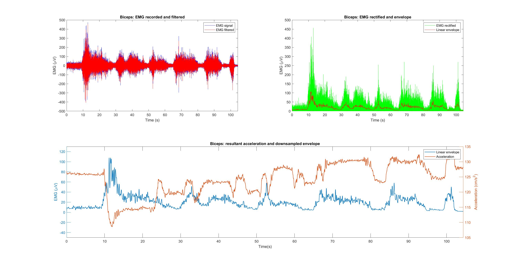
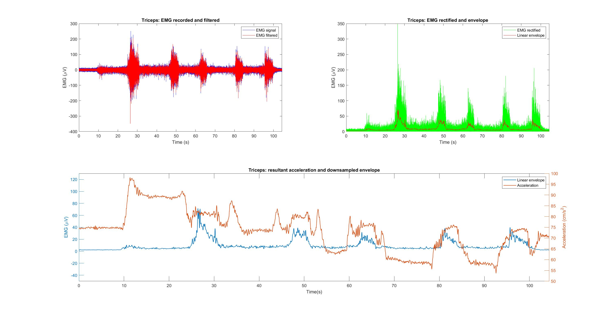
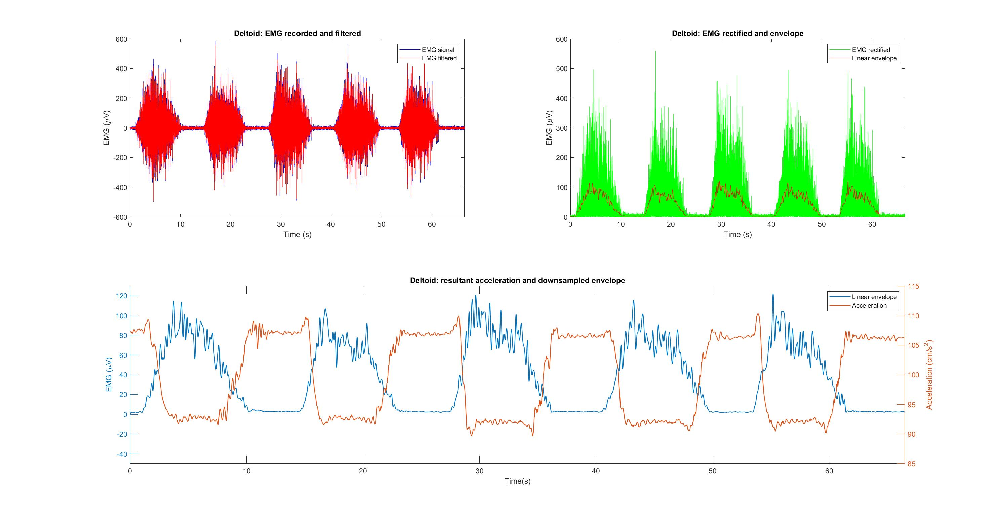

# Analysis of Muscle Electrical Activity

Two tests acquisitions with sample frequency Fs=2000.
The Structure is composed of matrix and labels of each column.
The matrices are NxM, where N is the number of samples and M the muscle acceleration.

## Test1: Voluntary activation of biceps-to-triceps. 

1. EMG Biceps
2. EMG Triceps
3. Biceps Accelerometer: X
4. Biceps Accelerometer: Y
5. Biceps Accelerometer: Z
6. Triceps Accelerometer: X
7. Triceps Accelerometer: Y

## Test2: Shoulder elevation muscles. 

1. EMG Deltoid
2. Deltoid Accelerometer: X
3. Deltoid Accelerometer: Y
4. Deltoid Accelerometer: Z

## Results

